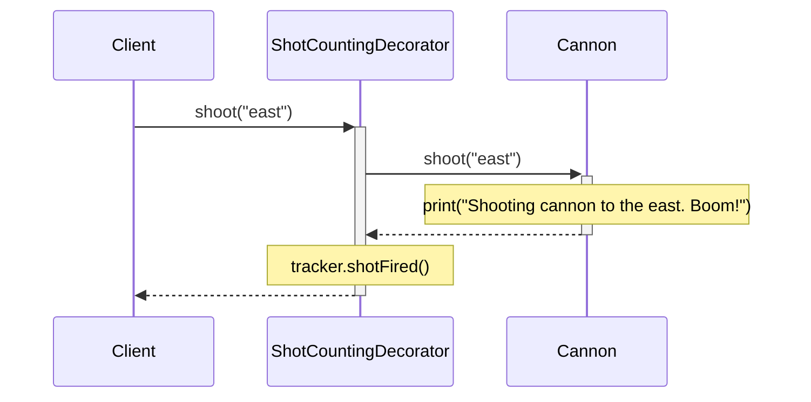
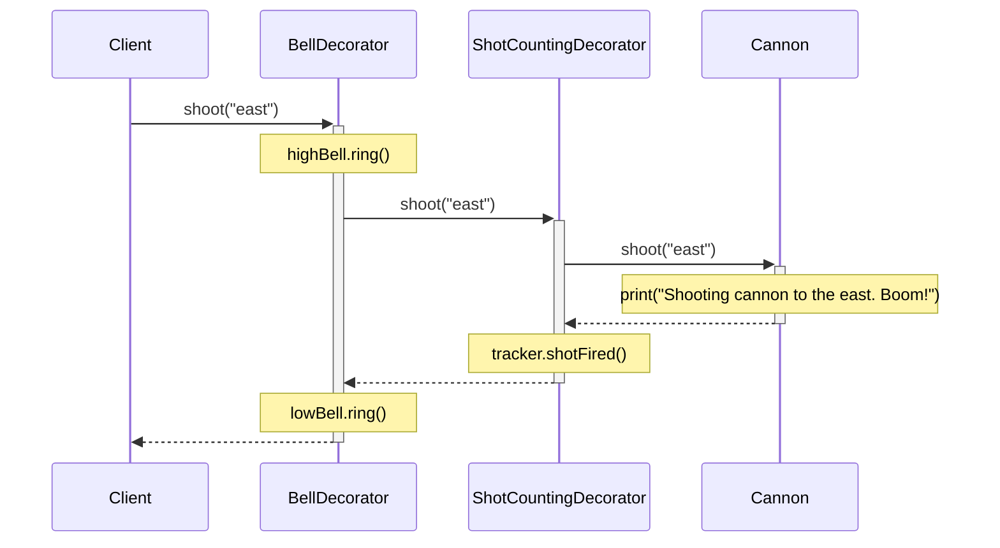
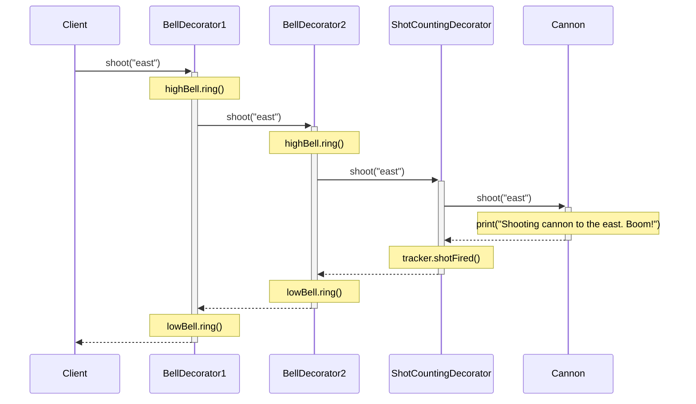

## This Must Never Happen Again

Imagine you're the captain of a notorious pirate ship at the dawn of the 18th century. You're in the middle of a raging sea battle. The air is filled with the smell of gunpowder and the deafening roar of cannon fire. You love it.  
Suddenly, a cry rings out across the deck: “We're out of cannonballs!”

The post-mortem meeting in the captain's cabin isn't fun for anyone. This failure must never happen again. You come to an agreement: From now on, every single cannon shot needs to be tracked so you can restock in time.

The master gunner quickly invents a mechanical counting device. Let's try to build it in.

## Opening up the Cannon

The gunner walks over to the cannon with some big heavy tool in his hand. And he **opens up the cannon**. Let's see, what do we have here?

```swift
class Cannon {
    func shoot(_ direction: String) {
        print("Shooting cannon to the \(direction). Boom!")
    }
}
```

If we rearrange things a bit, maybe we can fit the tracker in somehow.

```swift
class Cannon {
    private let tracker: ShotTracker  // Our tracker goes here

    init(tracker: ShotTracker) {   // Here we inject the tracker
        self.tracker = tracker
    }

    func shoot(_ direction: String) {
        print("Shooting cannon to the \(direction). Boom!")
        tracker.shotFired()  // Report each shot to the tracker
    }
}
```

### More Functionality
A few weeks later, the Freebooter's Union, advocating a safe working environment for pirates, demands ear protection during sea battles.

Let's make the cannon automatically ring a bell before and after each shot, so everyone can cover and uncover their ears with their hands. A high bell means "Cover your ears", and a low bell means "Uncover your ears".

```swift
class HighBell {
    func ring() {
        print("Ding!")
    }
}

class LowBell {
    func ring() {
        print("Dong!")
    }
}
```

Let's build these bells right into our cannon. There must be some space left in there.

```swift
class Cannon {
    private let tracker: ShotTracker
    private let highBell: HighBell  // Our high bell goes here
    private let lowBell: LowBell  // Our low bell goes here

    init(tracker: ShotTracker, highBell: HighBell, lowBell: LowBell) {
        self.tracker = tracker
        self.highBell = highBell
        self.lowBell = lowBell
    }

    func shoot(_ direction: String) {
        highBell.ring()  // Ring high bell before each shot
        print("Shooting cannon to the \(direction). Boom!")
        tracker.shotFired()
        lowBell.ring()  // Ring low bell after each shot
    }
}
```

You might start to see a problem here. But we're not done yet. The Freebooter's Union is increasing the safety requirements. The bell must now be rung **twice** before and after each shot, so each crew member has enough time to cover and uncover their ears.

```swift
class Cannon {
    private let tracker: ShotTracker
    private let highBell: HighBell
    private let lowBell: LowBell

    init(tracker: ShotTracker, highBell: HighBell, lowBell: LowBell) {
        self.tracker = tracker
        self.highBell = highBell
        self.lowBell = lowBell
    }

    func shoot(_ direction: String) {
        highBell.ring()
        highBell.ring()  // Ring a second time
        print("Shooting cannon to the \(direction). Boom!")
        tracker.shotFired()
        lowBell.ring()
        lowBell.ring()  // Ring a second time
    }
}
```

### Inspecting the Mess
Now let me ask you a question: What does a cannon do? What's its responsibility? The answer should be: It shoots. Period.

But look what we've done to our `Cannon`! It does all sorts of things: It rings a high bell. Rings it again. Oh, then it really does a little bit of shooting. Then it tracks the shot. It rings a low bell. Rings it again.  
Look what we need to create our `Cannon`. A tracker and two bells, three dependencies that have nothing to do with the core functionality of a cannon.

> You've probably seen this happen at a larger scale to classes like UIViewControllers or view models. Classes with too many responsibilities are hard to reason about, maintain, and test. And it only gets worse over time. Note that in a real program, the shooting logic might not be a one-liner, so the class could look a lot messier than in this simple example.
{: .prompt-info }

Now that we have such a counting device, what if we wanted to also keep track of shots fired from pistols and muskets? We'd end up having to open up every gun and build it in. Then, every time we wanted to work on the counting mechanism, we'd have to open up all guns again.

## A Better Way
Wouldn't it be nice if we could simply attach all extra devices like bells and counters to the outside of the cannon? This way, we don't interfere with the cannon's inner mechanics. And when the Freebooter's Union comes up with new requirements, changes are much simpler.

> This is called the Open-Closed Principle. Software components should be open for extension, but closed for modification.
{: .prompt-info }

So let's restore the Cannon to its original state and start over.

```swift
class Cannon {
    func shoot(_ direction: String) {
        print("Shooting cannon to the \(direction). Boom!")
    }
}
```

Now let's add the shot tracker from the outside.

### Preparation

First, we'll create a protocol and let `Cannon` conform to it.

```swift
protocol Shootable {
    func shoot(_ direction: String)
}

extension Cannon: Shootable {}  // Or add the conformance directly to the class, depending on your case
```

### Creating the Decorator

And here it comes, finally: the Decorator. A Decorator adds functionality to another object, the decoratee. It has the same interface (conforms to the same protocol) as its decoratee and forwards all method calls to it.

First, let's wrap a `Shootable` object and forward all method calls to it.

```swift
class ShotCountingDecorator: Shootable {
    private let decoratee: Shootable

    init(decoratee: Shootable) {
        self.decoratee = decoratee
    }

    func shoot(_ direction: String) {
        decoratee.shoot(direction)
    }
}
```

Now, let's add the shot counting functionality.

```swift
class ShotCountingDecorator: Shootable {
    private let decoratee: Shootable
    private let tracker: ShotTracker  // Add tracker dependency

    init(decoratee: Shootable, tracker: ShotTracker) {
        self.decoratee = decoratee
        self.tracker = tracker
    }

    func shoot(_ direction: String) {
        decoratee.shoot(direction)
        tracker.shotFired()  // Report each shot to the tracker
    }
}
```

Now the original `Cannon` class remains unchanged and simple, with only one single responsibility. We've added the shot tracking functionality strictly from the outside.

### Using the Decorator

The `ShotCountingDecorator` can now be used in place of the `Cannon` it wraps.

```swift
let tracker = ShotTracker()
let cannon = ShotCountingDecorator(decoratee: Cannon(), tracker: tracker)

cannon.shoot("east")
cannon.shoot("north")

print(tracker.firedShots)  // 2
```

Here's what it looks like in a sequence diagram (start at the top left and follow the arrows):



### Another Decorator

Now the first bell requirement arrives. High bell before the shot, low bell after the shot. Let's create a new Decorator for that.

```swift
class BellDecorator: Shootable {
    private let decoratee: Shootable
    private let highBell: HighBell
    private let lowBell: LowBell

    init(decoratee: Shootable, highBell: HighBell, lowBell: LowBell) {
        self.decoratee = decoratee
        self.highBell = highBell
        self.lowBell = lowBell
    }

    func shoot(_ direction: String) {
        highBell.ring()
        decoratee.shoot(direction)
        lowBell.ring()
    }
}
```

### Using Multiple Decorators

Let's attach counter and bells to the `Cannon` by nesting the two Decorators. The `BellDecorator` decorates the `ShotCountingDecorator` which decorates the `Cannon`.

```swift
let tracker = ShotTracker()
let cannon = BellDecorator(
    decoratee: ShotCountingDecorator(
        decoratee: Cannon(),
        tracker: tracker
    ),
    highBell: HighBell(),
    lowBell: LowBell()
)

cannon.shoot("east")  // "Ding! Shooting cannon to the east. Boom! Dong!
cannon.shoot("north")  // "Ding! Shooting cannon to the north. Boom! Dong!

print(tracker.firedShots)  // 2
```



### Chaining Decorators

We could continue nesting decorators this way. To ring the bells twice, we could have a `BellDecorator` decorating another `BellDecorator` decorating a `ShotCountingDecorator` decorating a `Cannon`. But it's becoming a bit hard to read, so let's improve this with a little protocol extension.

```swift
extension Shootable {
    func trackingShots(with tracker: ShotTracker) -> Shootable {
        ShotCountingDecorator(decoratee: self, tracker: tracker)
    }

    func ringingBells(high: HighBell, low: LowBell) -> Shootable {
        BellDecorator(decoratee: self, highBell: high, lowBell: low)
    }
}
```

Note that these methods are called on the type `Shootable` and also return a `Shootable`, which means we can chain them together in any order we like. Let's now ring the bells twice and track the shots.

```swift
let tracker = ShotTracker()
let highBell = HighBell()
let lowBell = LowBell()

let cannon = Cannon()
    .trackingShots(with tracker: tracker)
    .ringingBells(high: highBell, low: lowBell)
    .ringingBells(high: highBell, low: lowBell)

cannon.shoot("east")  // "Ding! Ding! Shooting cannon to the east. Boom! Dong! Dong!
cannon.shoot("north")  // "Ding! Ding! Shooting cannon to the north. Boom! Dong! Dong!

print(tracker.firedShots)  // 2
```

I find this much more readable. And it's now very easy to add or remove decorations or change the order.

Here's the updated sequence diagram:



### Reusing Decorators

Because it's now easy, let's also track pistol and musket shots, assuming these guns also conform to `Shootable`.

```swift
let pistol = Pistol().trackingShots(with tracker: tracker)
let musket = Musket().trackingShots(with tracker: tracker)
```

(Let's not get into different ammunition types here, which should probably be counted separately.)

## Wrapping It Up

> A common use case for Decorators are so-called cross-cutting concerns like logging, analytics, threading, or authentication, which are needed in several parts or layers of the program. Instead of scattering analytics or auth logic all over your codebase (and when the requirements change, you have to touch every module and every class), it's better to isolate these concerns to a central place by attaching these behaviors to your components from the outside like we did with the Cannon.
{: .prompt-info }

### Can't We Just Subclass?

You can also use inheritance to add behavior. But inheritance is less flexible (see [Composite Reuse Principle]()). Subclassing adds behavior to a whole class while a Decorator adds behavior to a single instance. With Decorators, it's easy to change the order of added behavior or to make one instance behave this way and another instance in another way, even at runtime.

### Caveats

- A decorator and its decoratee aren't identical. Just something to keep in mind in case you need to rely on identity.
- If you create too many little objects, that could potentially also create a mess. "A design that uses Decorator often results in systems composed of lots of little objects that all look alike. The objects differ only in the way they are interconnected, not in their class or in the value of their variables. Although these systems are easy to customize by those who understand them, they can be hard to learn and debug." (Design Patterns, p. 178)

### What's the Difference to the Proxy Pattern?

There's some confusion around the internet about the differences between these two patterns. I'll let the Gang of Four clear that up once and for all: "Although decorators can have similar implementations as proxies, decorators have a different purpose. A decorator adds one or more responsibilities to an object, whereas a proxy controls access to an object." (Design Patterns, p. 216)

### Your Turn

I'd like to encourage you to play around with this. Change the decoration order, or let the decorator do things before or after forwarding the method call, and try to guess what the output will be. Write your own decorator, for example you could clean the cannon after each shot (`print("Cleaning cannon")`). This will help you understand the concept better.

There is more to be said on this topic. If you’re interested, I’ll put some recommendations below.

Fair winds and goodbye!

---

## Links and References
- You can find the code on [GitHub](...).
- I first learned about this at [essentialdeveloper.com](https://www.essentialdeveloper.com). I can't recommend enough their iOS Lead Essentials program.
- Erich Gamma, Richard Helm, Ralph Johnson, John Vlissides. [Design Patterns - Elements of Reusable Object-Oriented Software](https://www.goodreads.com/book/show/85009.Design_Patterns). Addison-Wesley. P. 175-184, plus quotes above.
